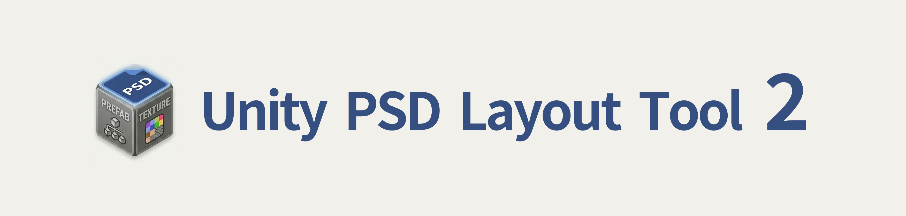
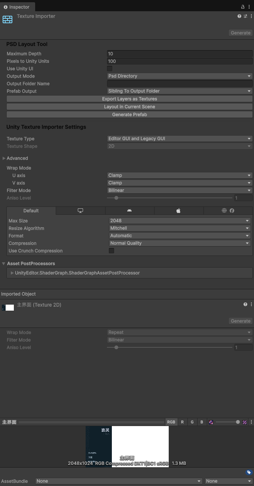



# UnityPSDLayoutTool2

`UnityPSDLayoutTool2` is a maintained fork of **UnityPSDLayoutTool**.

This project is explicitly based on the original `UnityPSDLayoutTool` and adds compatibility fixes and workflow improvements for newer Unity versions.

## 中文说明

`UnityPSDLayoutTool2` 是基于原始 **UnityPSDLayoutTool** 的维护增强版，重点补充了新版 Unity 兼容和中文工作流支持。

### Unity 版本支持

- 已验证可用：**Unity 6000.3.7f1**
- 原版插件面向较早期 Unity 版本；本项目在其基础上增加了对新版本 Unity 的适配。

### 相比 UnityPSDLayoutTool 的修改

1. 适配新版 Unity 编辑器 API。
2. 修复 PSD Unicode 解码，支持中文图层名与中文文本正确导入。
3. 增加中文友好的字体回退策略，降低中文文本乱码/方块字问题。
4. 增加更稳定的渲染顺序，减少相机角度变化导致的图层遮挡异常。
5. 增加导出目录可配置能力（资源输出目录可调整）。
6. 增加 Prefab 输出位置可配置：
   - 默认：Prefab 输出到生成资源文件夹的同级目录
   - 可选：Prefab 输出到生成资源文件夹内部
7. 增加可选“目标 Canvas”对齐：
   - 选择场景中的 Canvas 后，导入 UI 会按该 Canvas 像素坐标对齐
   - 不选择时保持旧行为，自动创建 World Space Canvas
8. 增加目标 Canvas 尺寸映射策略：
   - 支持按 Canvas 尺寸缩放
   - 支持“保持宽高比（不拉伸）”与“宽高独立缩放（可拉伸）”切换
9. 修复透明度导入：
   - 正确叠加 PSD 图层 Opacity 与蒙版 Alpha
   - 文本对象同样会应用图层透明度
10. 支持 Inspector 中英文切换（可持久化保存）。
11. 本分支重命名：
   - 插件目录：`Assets/PSDLayoutTool2`
   - 命名空间：`PsdLayoutTool2`

### 安装

把以下目录复制到 Unity 项目中：

- `Assets/PSDLayoutTool2`

### 使用方式

1. 将 `.psd` 文件放到 Unity 项目的 `Assets` 目录下。
2. 在 `Project` 面板选中该 PSD 文件。
3. 在 `Inspector` 中使用 **PSD Layout Tool 2** 的选项和按钮。

主要选项：

- `最大深度（Z）`
- `像素到单位（PPU）`
- `界面语言`（中文 / English）
- `使用 Unity UI`
- `目标 Canvas（可选）`
- `匹配目标 Canvas 尺寸`
- `保持宽高比（不拉伸）`
- `资源输出位置`
- `输出文件夹名`
- `Prefab 输出位置`

主要操作：

- `导出图层为纹理`
- `在当前场景中布局`
- `生成预制体`

#### Canvas 对齐模式（UI）

- `使用 Unity UI = true` 且 `目标 Canvas（可选）` 已选择：生成的根节点会作为 `RectTransform` 挂到目标 Canvas 下，坐标按 PSD 像素映射，便于与现有 UI 版式对齐。
- `匹配目标 Canvas 尺寸 = true`（默认）：会按目标 Canvas 尺寸进行缩放映射，解决 PSD 分辨率与 Canvas 分辨率不一致导致的错位。
  - 若 Canvas 使用 `Canvas Scaler / Scale With Screen Size`，会优先按 `Reference Resolution` 对齐。
- `匹配目标 Canvas 尺寸 = false`：保持 PSD 1:1 像素映射，适合你已经保证 PSD 与 Canvas 尺寸一致的情况。
- `保持宽高比（不拉伸） = true`（默认）：等比缩放，避免 X/Y 比例不一致造成拉伸。
- `保持宽高比（不拉伸） = false`：按宽高分别缩放，可能出现拉伸，但能完全铺满目标 Canvas 尺寸。
- `目标 Canvas（可选）` 留空或当前场景找不到该 Canvas：回退为旧行为，自动创建一个 World Space Canvas。
- `目标 Canvas（可选）` 是按场景层级路径保存的；如果你重命名或移动了 Canvas，请在 Inspector 里重新选择一次。

#### 透明度说明

- PSD 图层透明度（Opacity）会参与导出纹理与场景对象生成。
- 图层蒙版 Alpha 会与图层 Alpha 正确相乘，不再出现透明度异常。
- 文本层（UI Text / TextMesh）也会应用图层透明度。

### Photoshop 兼容性（栅格化）

Photoshop 的智能对象（Smart Objects）不在此插件的解析支持范围内。导入前建议先对相关图层进行栅格化。

操作路径：

1. 在 Photoshop 顶部菜单点击 **Layer**
2. 点击 **Rasterize**
3. 点击 **All Layers**（或按需栅格化目标图层）

### 特殊标签（与原版标签规则兼容）

标签解析规则：

- 标签匹配不区分大小写（例如 `|button` 与 `|Button` 等效）。
- 可以在同一层名里组合多个标签（例如 `Run|Animation|FPS=12`）。
- 识别到的标签会从生成对象的名称中移除。
- 只有特定模式下标签才会生效（见下表“生效条件”）。

#### 组图层标签（Folder / Group Layer）

| 标签 | 作用 | 生效条件 | 备注 |
| --- | --- | --- | --- |
| `|Animation` | 把该组的子图层作为帧，生成 Sprite 动画 | `Use Unity UI = false` | 会生成 `.anim` 和 `.controller`，并自动挂到对象上 |
| `|FPS=数字` | 指定 `|Animation` 的帧率 | 与 `|Animation` 同时使用 | 示例：`|FPS=12`、`|FPS=24` |
| `|Button` | 把该组作为一个按钮容器并读取子图层状态 | `Use Unity UI = true` | 非 UI 模式下不会创建按钮 |

动画命名示例：

- 组名：`HeroRun|Animation|FPS=12`
- 子图层：`run_01`, `run_02`, `run_03`...

按钮命名示例：

- 组名：`PlayButton|Button`
- 子图层：`Play_Up|Normal`, `Play_Down|Pressed`, `Play_Hover|Highlighted`, `Play_Disabled|Disabled`

#### 普通图层标签（Art Layer）

| 标签 | 作用 | 适用场景 |
| --- | --- | --- |
| `|Default` / `|Enabled` / `|Normal` / `|Up` | 作为按钮默认状态（同义标签） | `|Button` 组内 |
| `|Pressed` | 作为按钮按下状态 | `|Button` 组内 |
| `|Highlighted` | 作为按钮高亮状态 | `|Button` 组内 |
| `|Disabled` | 作为按钮禁用状态 | `|Button` 组内 |
| `|Text` | 将“非文本图层”作为按钮文字图像子节点 | `|Button` 组内，且该层不是文本层 |

当前实现限制：

- `|Animation` 在 `Use Unity UI = true` 时暂未实现 UI 动画生成。
- `|Button` 在 `Use Unity UI = false` 时暂未实现非 UI 按钮生成。
- `|Button` 组中的“文本图层（Text Layer）”子节点尚未自动生成为按钮子文本对象。

### 许可证

MIT License，见 [LICENSE.md](LICENSE.md)。

## Unity Version Support

- Verified working on: **Unity 6000.3.7f1**
- The original plugin targets much older Unity versions; this fork adds fixes to run on current Unity.

## What Was Changed Compared to UnityPSDLayoutTool

The following changes were added on top of the original `UnityPSDLayoutTool`:

1. Updated API compatibility for modern Unity editor versions.
2. Fixed PSD Unicode string decoding so Chinese layer names/text import correctly.
3. Added Chinese-friendly font fallback strategy for text import.
4. Added deterministic render ordering to reduce angle-dependent layer overlap issues.
5. Added configurable output folder behavior for generated assets.
6. Added configurable prefab output mode:
   - default: prefab saved as a sibling of the generated output folder
   - optional: prefab saved inside the generated output folder
7. Added optional target-canvas alignment for Unity UI:
   - when a scene canvas is selected, generated UI is aligned in that canvas coordinate space
   - when empty or not found, importer falls back to creating a world-space canvas
8. Added target-canvas scaling strategy options:
   - scale to target canvas size
   - choose between "preserve aspect ratio (no stretch)" and "independent X/Y scaling (may stretch)"
9. Fixed transparency import:
   - correctly composes PSD layer opacity with mask alpha
   - text objects also apply layer opacity
10. Added inspector language switch (Chinese / English), persisted in EditorPrefs.
11. Renamed plugin folder and namespace for this fork:
   - Folder: `Assets/PSDLayoutTool2`
   - Namespace: `PsdLayoutTool2`

## Installation

Copy the folder below into your Unity project:

- `Assets/PSDLayoutTool2`

## Usage

1. Put a `.psd` file under your Unity project's `Assets` directory.
2. Select the PSD file in the Project window.
3. In Inspector, use **PSD Layout Tool 2** options and buttons.

Main options include:

- `Maximum Depth (Z)`
- `Pixels To Units (PPU)`
- `Inspector Language` (Chinese / English)
- `Use Unity UI`
- `Target Canvas (Optional)`
- `Scale To Target Canvas`
- `Preserve Aspect Ratio (No Stretch)`
- `Output Directory`
- `Output Folder Name`
- `Prefab Output`

Actions:

- `Export Layers As Textures`
- `Layout In Current Scene`
- `Generate Prefab`

### Canvas Alignment Mode (UI)

- When `Use Unity UI = true` and `Target Canvas (Optional)` is set, the generated root is created as a `RectTransform` under that canvas and positioned in PSD pixel space.
- `Scale To Target Canvas = true` (default) scales PSD positions and sizes to the selected canvas rect, which fixes mismatches when PSD and canvas resolutions differ.
  - If the canvas uses `Canvas Scaler / Scale With Screen Size`, mapping uses `Reference Resolution` first.
- `Scale To Target Canvas = false` keeps a strict 1:1 PSD pixel mapping.
- `Preserve Aspect Ratio (No Stretch) = true` (default) uses uniform scaling to avoid stretch when aspect ratios differ.
- `Preserve Aspect Ratio (No Stretch) = false` scales X/Y independently, which may stretch but fills target canvas size exactly.
- When `Target Canvas` is empty or no longer found in scene, importer falls back to legacy behavior and creates a world-space canvas.
- `Target Canvas` is persisted by hierarchy path; if you rename or move the canvas, reselect it in Inspector.

### Transparency Notes

- PSD layer opacity is applied during texture export and object generation.
- Mask alpha is correctly multiplied with layer alpha.
- Text layers (UI Text / TextMesh) also apply layer opacity.

## Photoshop Compatibility (Rasterize)

Photoshop Smart Objects are not fully supported by this importer pipeline. Rasterize the relevant layers before import.

Steps:

1. In Photoshop menu, click **Layer**
2. Click **Rasterize**
3. Click **All Layers** (or rasterize only target layers as needed)

## Special Tags (same as original behavior)

Tag parsing rules:

- Tag matching is case-insensitive (for example, `|button` equals `|Button`).
- Multiple tags can be combined in one layer name (for example, `Run|Animation|FPS=12`).
- Recognized tags are removed from generated object names.
- Tags are mode-dependent and only work under specific conditions.

### Group Layer Tags

| Tag | Behavior | Effective when | Notes |
| --- | --- | --- | --- |
| `|Animation` | Creates a sprite animation from child layers | `Use Unity UI = false` | Generates `.anim` + `.controller` and assigns animator |
| `|FPS=number` | Sets FPS for `|Animation` | Used with `|Animation` | Example: `|FPS=12`, `|FPS=24` |
| `|Button` | Builds a UI button from child state layers | `Use Unity UI = true` | No non-UI button implementation currently |

Animation naming example:

- Group: `HeroRun|Animation|FPS=12`
- Children: `run_01`, `run_02`, `run_03`...

Button naming example:

- Group: `PlayButton|Button`
- Children: `Play_Up|Normal`, `Play_Down|Pressed`, `Play_Hover|Highlighted`, `Play_Disabled|Disabled`

### Art Layer Tags

| Tag | Behavior | Typical usage |
| --- | --- | --- |
| `|Default` / `|Enabled` / `|Normal` / `|Up` | Normal button state (synonyms) | Inside a `|Button` group |
| `|Pressed` | Pressed button state | Inside a `|Button` group |
| `|Highlighted` | Highlighted button state | Inside a `|Button` group |
| `|Disabled` | Disabled button state | Inside a `|Button` group |
| `|Text` | Treats a non-text art layer as button text image child | Inside a `|Button` group |

Current limitations:

- `|Animation` is not implemented for UI mode (`Use Unity UI = true`).
- `|Button` is not implemented for non-UI mode (`Use Unity UI = false`).
- Text-layer children inside `|Button` are currently not auto-generated as child text objects.

## License

MIT License. See [LICENSE.md](LICENSE.md).

## Credit

This project is based on the original **UnityPSDLayoutTool** and keeps the same MIT license model.

